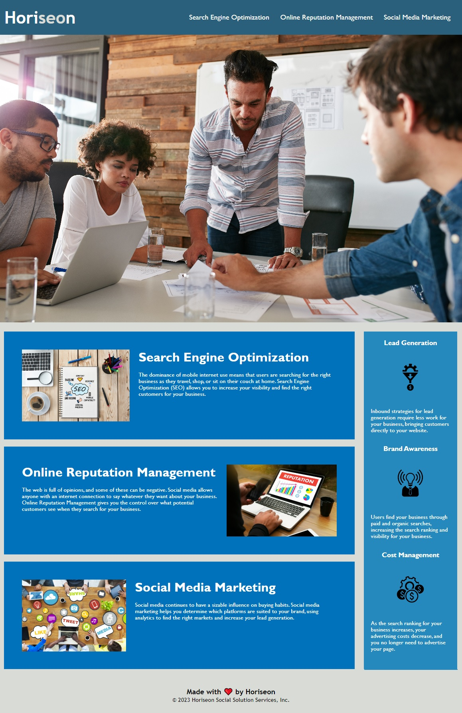

# Horisen Code Refactor

## Description

The code has been refactored for improved accessibility, without editing the appearance of the website.

### Code refactoring:
* Added Horiseon title to website
* Added semantic HTML elements
* Corrected navigation linking
* Added alt text to images
* Added explanatory comments to HTML and CSS documents
* Consolidated CSS classes and ids with matching properties
* Reorganised CSS to follow HTML semantic and logical structure
* Updated copyright year in footer

## Usage

This application presents the website homepage for Horiseon, a marketing agency. It can be viewed in any desktop browser. 
**Note**: The application is currently non-responsive and therefore is not optimised for screens with a resolution smaller than 768px. 

### Links

* [Deployed website](https://aoifeedx.github.io/horiseon-code-refactor/)
* [GitHub code repository](https://github.com/AoifeEdX/horiseon-code-refactor)

## Credits

Starter code and instructions provided by edX (Skills Boot Camp in Front-End Web Development).

### Resources

The following sites were used for reference in refactoring the code:

* [https://learntheweb.courses/topics/html-semantics-cheat-sheet/](https://learntheweb.courses/topics/html-semantics-cheat-sheet/)
* [https://www.codecademy.com/learn/learn-html/modules/learn-semantic-html/cheatsheet](https://www.codecademy.com/learn/learn-html/modules/learn-semantic-html/cheatsheet4)
* [https://www.w3schools.com/html/html5_semantic_elements.asp](https://www.w3schools.com/html/html5_semantic_elements.asp)
* [https://blog.hubspot.com/website/comment-out-in-html](https://blog.hubspot.com/website/comment-out-in-html)
* [https://www.w3schools.com/css/css_comments.asp](https://www.w3schools.com/css/css_comments.asp)

## License

MIT License

Copyright (c) 2023 AoifeEdX

Permission is hereby granted, free of charge, to any person obtaining a copy of this software and associated documentation files (the "Software"), to deal in the Software without restriction, including without limitation the rights to use, copy, modify, merge, publish, distribute, sublicense, and/or sell copies of the Software, and to permit persons to whom the Software is furnished to do so, subject to the following conditions:

The above copyright notice and this permission notice shall be included in all copies or substantial portions of the Software.

THE SOFTWARE IS PROVIDED "AS IS", WITHOUT WARRANTY OF ANY KIND, EXPRESS OR IMPLIED, INCLUDING BUT NOT LIMITED TO THE WARRANTIES OF MERCHANTABILITY, FITNESS FOR A PARTICULAR PURPOSE AND NONINFRINGEMENT. IN NO EVENT SHALL THE AUTHORS OR COPYRIGHT HOLDERS BE LIABLE FOR ANY CLAIM, DAMAGES OR OTHER LIABILITY, WHETHER IN AN ACTION OF CONTRACT, TORT OR OTHERWISE, ARISING FROM, OUT OF OR IN CONNECTION WITH THE SOFTWARE OR THE USE OR OTHER DEALINGS IN THE
SOFTWARE.
